# EntrenaMe 🏋️‍♂️💻

**EntrenaMe** es una aplicación web diseñada como el segundo proyecto del curso de Desarrollo de Aplicaciones Web (DAW).  
Su objetivo es gestionar las actividades y servicios de un polideportivo con un enfoque especial en las necesidades de las personas de la tercera edad.  
La plataforma permite a los usuarios explorar actividades, inscribirse en ellas, reservar pistas deportivas y mantenerse activos, fomentando un estilo de vida saludable y adaptado a sus capacidades.

## Tabla de Contenidos 📚

1. [Descripción del Proyecto](#entrename)
2. [Características de la Aplicación](#características-de-la-aplicación)
3. [Tecnologías Utilizadas](#tecnologías-utilizadas)
    - [Frontend](#frontend)
    - [Backend](#backend)
4. [Estructura del Proyecto](#estructura-del-proyecto)
5. [Vistas del Proyecto](#vistas-del-proyecto)
6. [Contribución](#contribución-🤝)

---

## Características de la Aplicación 🌟

- **Gestión de actividades**: Los usuarios pueden explorar una lista de actividades especialmente diseñadas para la tercera edad y registrarse en ellas.
- **Reserva de pistas deportivas**: Posibilidad de reservar pistas disponibles para deportes como tenis, pádel, fútbol, básquet, entre otros.
- **Sistema de autenticación**: Registro e inicio de sesión para usuarios.
- **Panel de administración**: Gestión de usuarios, actividades y reservas por parte del personal del polideportivo.
- **Interfaz adaptada**: Diseño accesible e intuitivo, pensado para facilitar la navegación a personas mayores.

---

## Tecnologías Utilizadas 🛠️

### Frontend
- **React**: Utilizado para el panel de administración.
- **Vue 3**: Framework principal para la aplicación web completa.

  

    

### Backend
- **Laravel**: Usado para gestionar el backend del panel de administración.
- **Spring Boot**: Utilizado para el backend de la aplicación principal y un servicio adicional dedicado a la integración con Mailgun para gestionar correos.
- **Node.js**: Implementado como un servidor proxy inverso para permitir que ambos frontends (React y Vue) compartan el mismo dominio.

  

    

### Base de datos
-**MySQL**: Usado para guardar toda la información persistente de la aplicación.

    

---

## Estructura del Proyecto 🗂️

La arquitectura del proyecto está dividida en múltiples frontends y backends, cada uno con roles específicos:

### Frontends
1. **Panel de Administración (React)**:
   - Permite a los administradores gestionar actividades, reservas y usuarios.
   - Se comunica con el backend de Laravel para realizar las operaciones CRUD necesarias.

2. **Aplicación Principal (Vue 3)**:
   - Interfaz principal para los usuarios finales.
   - Permite explorar actividades, reservar pistas y acceder a contenido adaptado a la tercera edad.
   - Se conecta con el backend de Spring Boot para acceder a datos y realizar acciones.

### Backends
1. **Laravel**:
   - Backend para el panel de administración.
   - Gestiona la autenticación, administración de actividades, pistas y usuarios.
   - Es la API de la que se nutre React.

2. **Spring Boot**:
   - Backend principal de la aplicación.
   - Maneja las reservas de pistas, registro de usuarios y gestión de actividades para los usuarios finales.
   - Es la API de la que se nutre Vue.

3. **Spring Boot (Mailgun)**:
   - Servicio dedicado para gestionar el envío de correos electrónicos.
   - Integración con la API de Mailgun para notificaciones automatizadas.

4. **Node.js (Proxy Inverso)**:
   - Actúa como un servidor proxy inverso.
   - Permite que los frontends (React y Vue) compartan el mismo dominio, mejorando la experiencia del usuario y simplificando la gestión del servidor.

---

## Vistas del Proyecto 👀

### 1. Home 🏠
- **Search**: Barra de búsqueda que permite a los usuarios buscar actividades por nombre.
- **Carrusel de Deportes**: Componente que muestra un carrusel con actividades categorizadas por deporte.
- **Scroll Infinito**: Sección en la parte inferior de la página que despliega actividades enfocadas a la tercera edad, con carga dinámica al desplazarse.

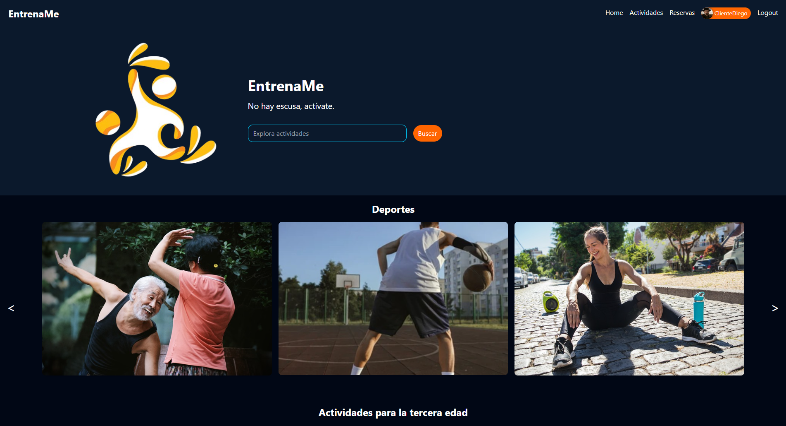

### 2. Actividades 🏃‍♂️
- **Filtros Disponibles**:
  - Por horario: Permite buscar actividades según la hora en que se realizan.
  - Por día: Filtra actividades disponibles en días específicos.
  - Por deporte: Muestra actividades categorizadas según el deporte.
  - Por nombre: Posibilidad de buscar actividades directamente por su nombre.
- **Parte Principal de la Aplicación**: Esta página sirve como el núcleo de la aplicación, proporcionando acceso rápido y sencillo a todas las actividades disponibles.

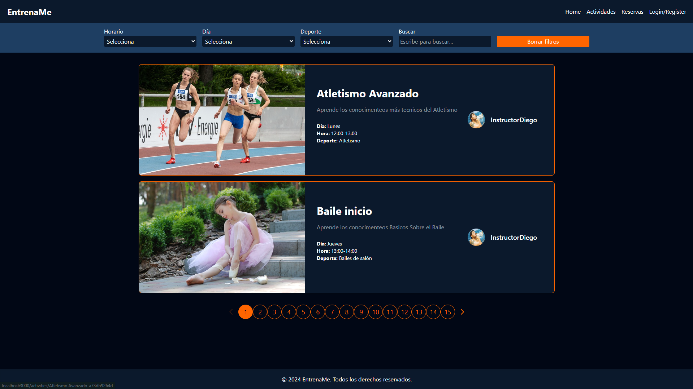

### 3. Página Details 📄
- **Detalles de la Actividad**:
  - Información completa sobre la actividad, incluyendo nombre, descripción, horario y requisitos.
- **Acciones Disponibles**:
  - **Inscripción**: Los usuarios registrados pueden apuntarse directamente a la actividad desde esta página.
  - **Comentarios**: Los usuarios logeados pueden dejar comentarios sobre la actividad para compartir su experiencia o dudas.

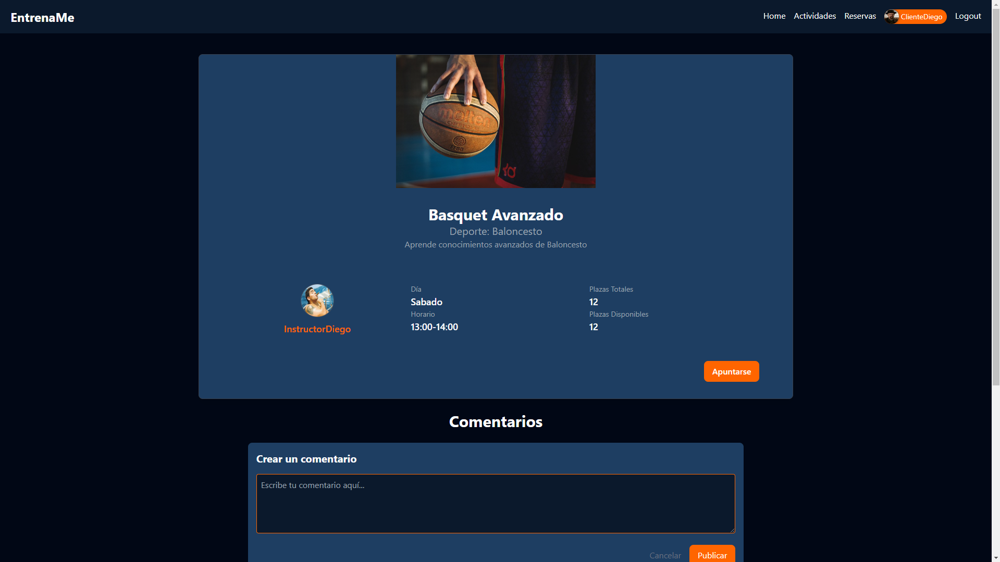

### 4. Reserva de Pistas 🎾
- **Filtros Inteligentes**:
  - Los filtros se actualizan dinámicamente para mostrar solo las combinaciones posibles (como fecha, hora y pista).
- **Mapa del Polideportivo**:
  - Muestra un plano informativo del polideportivo.
  - Resalta la pista que el usuario ha reservado para una mejor orientación.
- **Tarjeta de Información**:
  - Detalles de la reserva realizada, como el tipo de pista, horario y día.

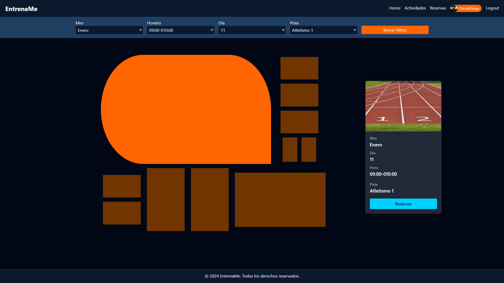

### 5. Perfil 👤
- **Datos Básicos del Usuario**:
  - Información personal del usuario, como nombre, correo electrónico, y foto de perfil.
- **Secciones del Perfil**:
  - **Comentarios**: Listado de comentarios realizados por el usuario en las actividades.
  - **Seguidos y Seguidores**: Muestra a quién sigue el usuario y quién lo sigue.
  - **Reservas**: Pistas reservadas por el usuario.
  - **Actividades Inscritas**: Listado de actividades en las que el usuario está inscrito.

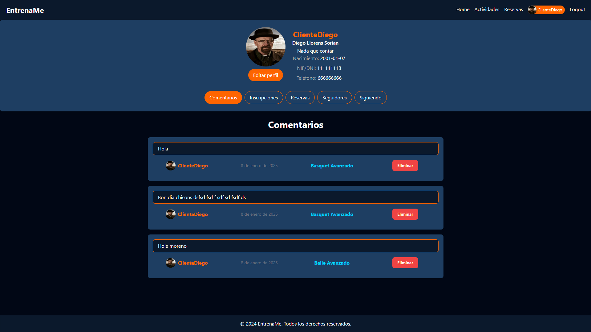

### 6. Editar el Perfil ✏️
- **Edición de Datos Básicos**:
  - Permite modificar información personal.
  - Incluye validaciones para asegurar que los datos ingresados sean correctos.

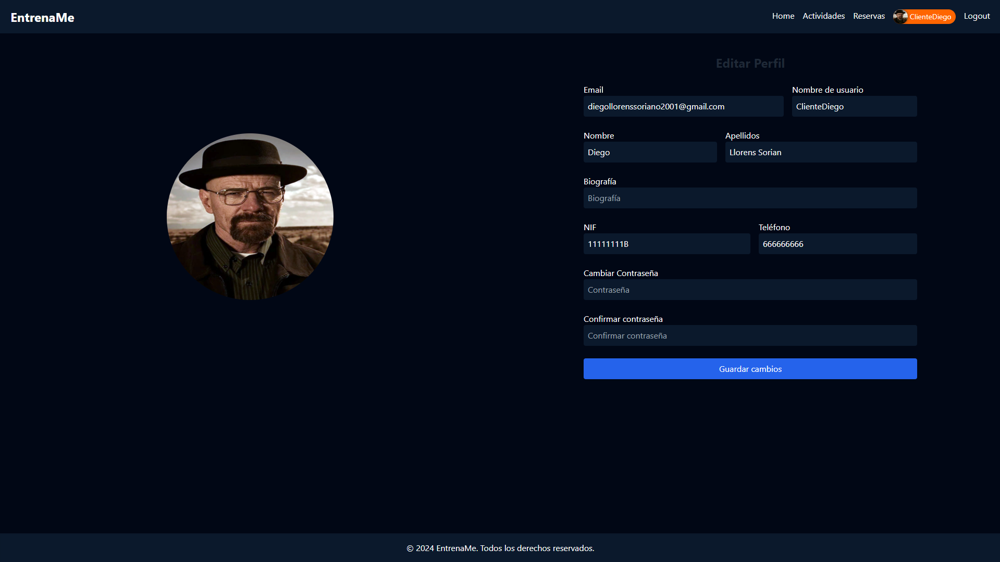

### 7. Login 🔒
- **Formulario de Inicio de Sesión**:
  - Campos para ingresar el correo electrónico y la contraseña del usuario.
  - Botón de acceso para autenticar al usuario en la plataforma.
- **Opciones Adicionales**:
  - Redirección al registro para nuevos usuarios que aún no tienen una cuenta.

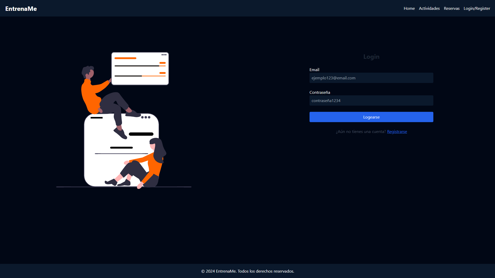

### 8. Register 📝
- **Registro de Nuevos Usuarios**:
  - Permite crear una cuenta seleccionando entre tres tipos de usuario:
    - **Cliente**: Usuario general que utiliza la aplicación.
    - **Instructor**: Profesionales que gestionan actividades.
    - **Administrador**: Personal encargado de la administración del sistema.
  - Los campos del formulario cambian dinámicamente según el tipo de usuario seleccionado.
- **Validación**:
  - Validaciones dinámicas para asegurar la correcta entrada de datos.
  - Mensajes de error claros en caso de que los datos no cumplan con los requisitos.

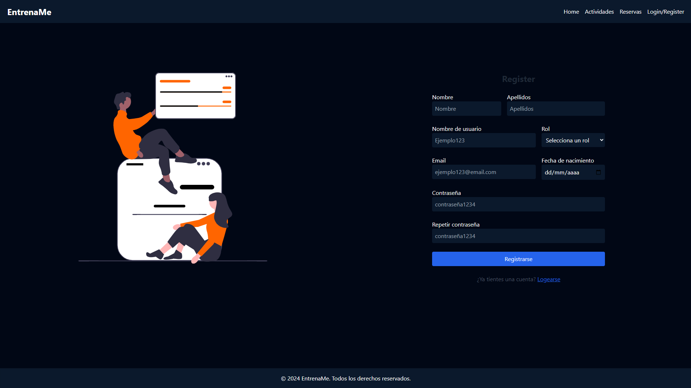

### 9. Dashboard 📊
El panel principal de administración para gestionar diferentes aspectos del sistema. Incluye las siguientes sub-vistas:

#### 9.1. Creación y Modificación de Deportes 🏅
- **Gestión de Deportes**:
  - Permite crear nuevos deportes con sus características específicas.
  - Editar deportes existentes para ajustar su información o eliminar deportes que ya no sean necesarios.

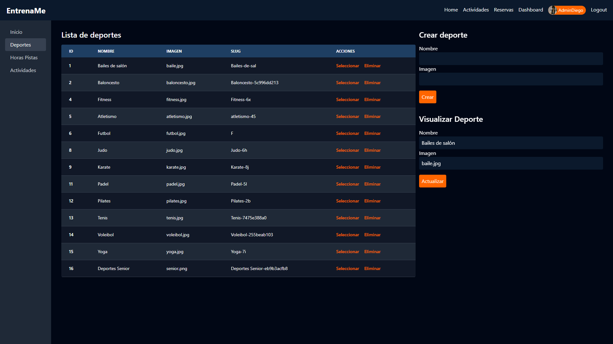

#### 9.2. Calendario para Reservas de Pistas 📅
- **Vista de Calendario**:
  - Muestra un calendario interactivo con las reservas existentes.
  - Permite visualizar horarios ocupados y libres en las diferentes pistas.
  - Incluye opciones para filtrar por tipo de pista o fecha específica.
  - Posibilidad de añadir, editar o cancelar reservas directamente desde el calendario.

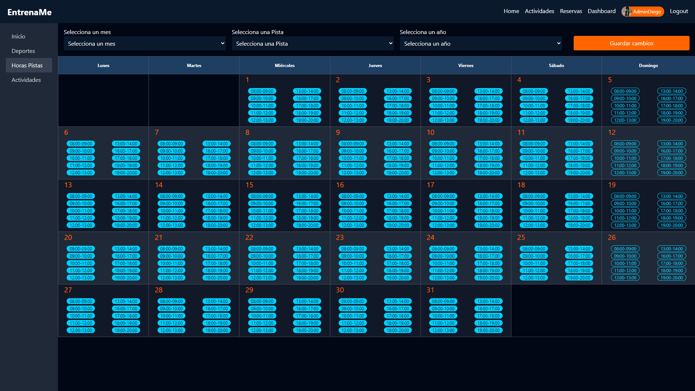

#### 9.3. Creación y Modificación de Actividades 🗓️
- **Gestión de Actividades**:
  - Crear nuevas actividades especificando detalles como nombre, descripción, horario, y deporte relacionado.
  - Modificar actividades existentes para actualizar información o eliminar actividades obsoletas.
  - Opciones para asignar instructores a las actividades creadas.

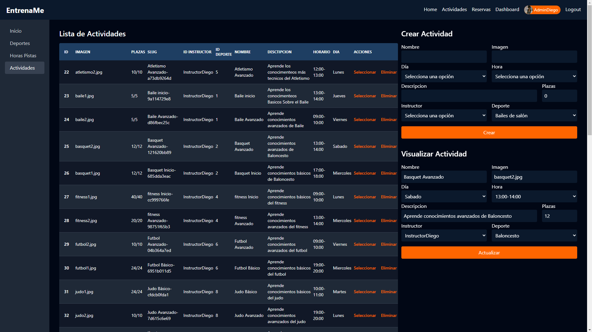

---

## Contribución 🤝

Este proyecto ha sido realizado en conjunto por [Paco Montés](https://github.com/fmontesdev) y [Diego Llorens](https://github.com
